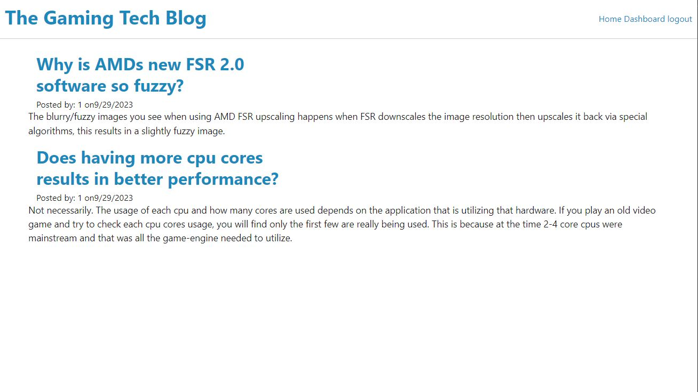

  
  # Tech Blog

  ## Description
  A CMS-style blog site similar to a Wordpress site, where link minded individuals can publish their blog posts and comment on other developers’ posts as well.

  ## Table of Contents
  * [Installation](#install)
  * [Usage](#usage)
  * [Contributions](#contribute)
  * [Test](#test)
  * [Credits](#credits)
  * [License](#license)
  * [Link](#link)
  * [Questions](#question)
  
  ## Installation
  bcrypt 
  
  connect-session-sequelize
  
  dotenv  
  
  express
  
  express-handlebars
  
  express-session
  
  handlebars
  
  mysql2
  
  sequelize

  ## Usage 
  A place for individuals to speak about gaming tech!

  ## Contributions
  N/A

  ## Test
  N/a

  ## Credits
  For use of jass.css /public/jass.css - please refer to github repo: https://github.com/necolas/normalize.css

  ## License
  GNU

  ## Link to deployed site
  https://calm-temple-98110-2c930c6cc794.herokuapp.com/

  ## Question
  Please refer to my github for other awesome projects! https://github.com/james-brainard

  If you have any questions regarding this application or any others. You can reach me at: james.brainard2@aol.com

  ## Screenshot of Application
  